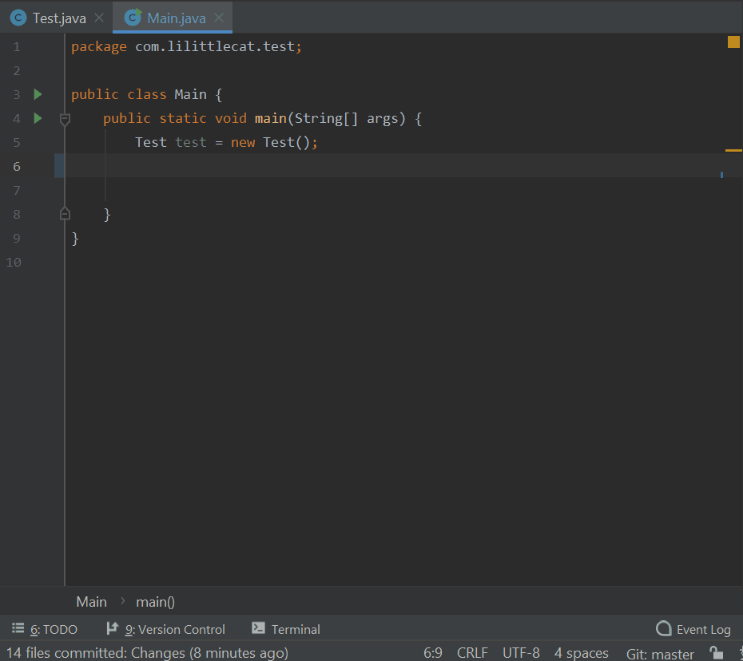
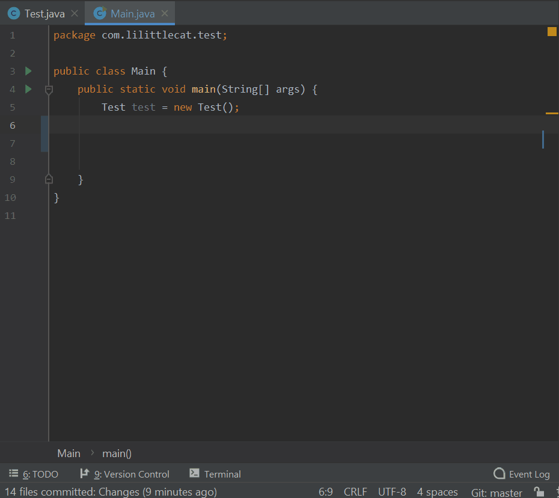

# Generate All Getter And Setter

[English](README.md)

Generate All Getter And Setter 是一个 IntelliJ IDEA 插件，可以通过 [后缀补全](https://www.jetbrains.com/help/idea/settings-postfix-completion.html)（类似于 <kbd>.var</kbd>）为 POJO 类生成所有的 getter 和 setter 方法。

[comment]: <> (<!-- Plugin description -->)

[comment]: <> (This Fancy IntelliJ Platform Plugin is going to be your implementation of the brilliant ideas that you have.)

[comment]: <> (This specific section is a source for the [plugin.xml]&#40;/src/main/resources/META-INF/plugin.xml&#41; file which will be extracted by the [Gradle]&#40;/build.gradle.kts&#41; during the build process.)

[comment]: <> (To keep everything working, do not remove `<!-- ... -->` sections.)

[comment]: <> (<!-- Plugin description end -->)

## 安装方法

- 使用 IDE 内置的插件系统安装：

  <kbd> 设置 / 首选项 </kbd> > <kbd> 插件 </kbd> > <kbd> 市场 </kbd> > <kbd> 搜索 "Generate All Getter And Setter"</kbd> >
  <kbd> 安装插件 </kbd>

- 手动安装：

  下载 [最新版本](https://plugins.jetbrains.com/plugin/18969-generate-all-getter-and-setter/versions)
  并手动安装：
  <kbd> 设置 / 首选项 </kbd> > <kbd> 插件 </kbd> > <kbd>⚙️</kbd> > <kbd> 从磁盘安装插件...</kbd>

## 使用方法

- 使用 <kbd>.allget</kbd> 生成所有的 getter 方法。

- 使用 <kbd>.allset</kbd> 生成所有不带默认值的 setter 方法。

- 使用 <kbd>.allsetv</kbd> 生成所有带默认值的 setter 方法。

- 使用 <kbd>.allsetc</kbd> 生成所有链式风格的 setter 方法。

- 使用 <kbd>.allsetcv</kbd> 生成所有带默认值的链式风格 setter 方法。

## 特别感谢

- 感谢 [XiaoYao][XiaoYao's link] 帮助设计插件图标。
- [IntelliJ Platform Plugin Template][template].

---

[XiaoYao's link]: https://space.bilibili.com/15765234
[JetBrains's link]: https://jb.gg/OpenSourceSupport
[template]: https://github.com/JetBrains/intellij-platform-plugin-template 